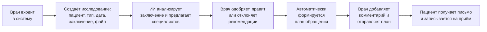

# Акведук

**Акведук** - веб-сервис маршрутизации пациента после ИИ-анализа КТ, рентгена, ФЛГ и маммографии. По заключению ИИ сервис предлагает, к каким специалистам и с каким приоритетом направить пациента; врач проверяет рекомендации, а пациент получает на почту персональный план обращения со ссылкой для записи на приём.

> Проект создан командой «cord доступа» в рамках хакатона MedITron 2026 по кейсу компании «Третье Мнение». Статус: в разработке.

## Цели и задачи

- Снизить рутинную нагрузку на врача при помощи ИИ-сервиса **Акведук** путем обраобтки снимков и формирования рекоммендаций для пациентов.
- Снизить долю пациентов, которые прерывают лечение или не возвращаются на приём.
- Показать схему интеграции сервиса в контур клиники (МИС/РИС, сайт, приложение).

## Пользовательский путь

Основной пользователь - врач клиники. Пациент в интерфейсе не работает: он получает результат по email.



1. **Вход.** Врач регистрируется или входит на странице `/login`. Все остальные страницы доступны только с токеном.
2. **Список исследований.** На странице `/studies` видны все исследования: пациент, тип, дата и число рекомендаций.
3. **Создание исследования** (`/studies/add`). Врач выбирает существующего пациента или создаёт нового (ФИО, дата рождения, пол, телефон, email), указывает тип исследования, дату, прикладывает файл и вводит заключение. Заключение можно подставить из прошлых исследований этого пациента.
4. **Автоматический ИИ-анализ.** После сохранения исследования сервис сам отправляет заключение в GigaChat. В запрос уходят только возраст и пол пациента, персональных данных там нет. В ответ приходит список специалистов с приоритетом, обоснованием и уверенностью модели.
5. **Проверка врачом** (`/studies/view`). Для каждой рекомендации врач может одобрить, отклонить, отредактировать её или добавить собственную. При необходимости ИИ-анализ можно запустить заново.
6. **План обращения.** Как только все рекомендации проверены, автоматически создаётся черновик плана из одобренных пунктов. Врач может добавить к нему комментарий.
7. **Отправка.** Врач подтверждает отправку, и пациенту на email уходит письмо: данные пациента, заключение, план, комментарий врача, файл исследования, ссылка и телефон для записи. После отправки план и рекомендации блокируются от изменений.

## Что реализовано

### Backend

- **REST API** на Django + Django REST Framework.
- **Аутентификация** по токенам (`/api/auth/register/`, `/api/auth/login/`, `/api/auth/logout/`, `/api/auth/me/`).
- **Пациенты и исследования**: создание, список, карточка, загрузка и скачивание файла исследования.
- **Интеграция с GigaChat** (модель `GigaChat-2 Lightning`) для анализа заключений.
- **Автоматический запуск ИИ-анализа** при создании исследования (Django signals).
- **Автосоздание плана обращения** при проверке всех рекомендаций врачом.
- **Комментарий врача** к плану и **отправка плана пациенту** по email.
- **Кастомизированная админка** для врача (кнопки «Одобрить» / «Отклонить», вложенные таблицы).
- **Отправка email** через Gmail SMTP с вложением файла исследования. Без настроенной почты письмо печатается в консоль бэкенда.
- **Swagger-документация** API (`/api/docs/`).
- **Анонимизация персональных данных**: ФИО, дата рождения, телефон и email хранятся в отдельном JSON-реестре, в БД остаётся только код пациента, возраст и пол, а в GigaChat уходят только возраст и пол.
- **Автотесты** API (`python manage.py test core`, 34 теста).

### ML / NLP

- **Отдельный модуль `nlp_module/`**, не привязанный к Django.
- **Защита от prompt-инъекций** - заключение обёрнуто в маркеры.
- **Валидация ответа модели** по белому списку из 30 специальностей и допустимых приоритетов.
- **Починка битого JSON** - повторный запрос к LLM при ошибке парсинга.
- **Нормализация полей** - `confidence` обрезается до [0.0, 1.0].
- **Соответствие медицинским рекомендациям** - ИИ-рекомендации составляются в соответствии с клиническими рекомендациями РФ

### Frontend

- **Страницы**: вход и регистрация (`/login`), список исследований (`/studies`), создание исследования (`/studies/add`), карточка исследования (`/studies/view?id=…`), профиль (`/profile`).
- **Создание исследования**: выпадающие списки пациента и типа исследования, календарь для даты, файл, маска телефона `+7 (XXX) XXX-XX-XX`, возраст считается из даты рождения.
- **Карточка исследования**: заключение с возможностью свернуть, карточки рекомендаций (одобрить, отклонить, править), форма собственной рекомендации, перегенерация ИИ, блок плана обращения с комментарием врача и отправкой.
- **Авторизация**: токен в `localStorage`, защита маршрутов, выход с подтверждением, инициалы пользователя в шапке.
- **Адаптивные формы**, переиспользуемые компоненты (`SelectBox`, `ConfirmDialog`, `TextBox`).

## Технологический стек

| Слой | Технологии |
|---|---|
| Backend | Python 3.14, Django 6.1, Django REST Framework 3.18, django-cors-headers, drf-spectacular, SQLite |
| ML / NLP | GigaChat API (SDK `gigachat` 0.2.3), python-dotenv |
| Frontend | React 19, TypeScript 6, Vite 8, React Router 6, шрифт Montserrat |
| Инфраструктура | Docker, Docker Compose, nginx (раздаёт фронтенд и проксирует `/api/` на бэкенд) |

## Структура репозитория

```
backend/
  app/
    core/           # модели, API (views, serializers), сигналы, админка, отправка писем, тесты
    nlp_module/     # анализ заключения через GigaChat (не зависит от Django)
    medroute/       # настройки и маршруты Django-проекта
  requirements.txt
  Dockerfile
frontend/
  src/
    api/            # запросы к бэкенду
    components/     # переиспользуемые компоненты
    hooks/          # хуки загрузки данных
    pages/          # страницы приложения
    layouts/        # общий каркас с шапкой
    types/          # типы данных API
    utils/          # форматирование дат, телефона, инициалов
  nginx.conf
  Dockerfile
data/
  registry/         # JSON-реестр персональных данных пациентов (том Docker)
docs/               # архитектура и презентация
docker-compose.yml
docker-compose.override.yml   # режим разработки: автоперезагрузка бэкенда
.env.example        # шаблон переменных окружения
```

## Быстрый старт

Требования: Docker и Docker Compose.

```bash
git clone https://github.com/Fynzh/ThirdOpinion_AI_patient_router.git
cd ThirdOpinion_AI_patient_router
cp .env.example .env
# впишите в .env ключ GigaChat (см. ниже) и по возможности данные почты.
# для теста можете использовать наши данные
docker compose up --build
```

Содержимое `.env`:

```env
# Ключ авторизации GigaChat (обязателен для ИИ-рекомендаций)
GIGACHAT_KEY=

# Необязательно: почта для реальной отправки писем пациентам (Gmail, пароль приложения).
# Если не заданы, письма печатаются в консоль бэкенда.
EMAIL_HOST_USER=
EMAIL_HOST_PASSWORD=
```
Наши данные для теста:

```env
GIGACHAT_KEY=MDFhMGZlYWQtNDI0OC03ZjUwLWFiZDMtNTNhYjdmNDBjOGIxOjdmOTdmNGQyLWYxMWUtNDBkYS1hYTIxLWIwZTk0ZDM4YWI0ZA==
EMAIL_HOST_USER=aqueduccorddostupa@gmail.com
EMAIL_HOST_PASSWORD=jdbz dnmr ntsc smad
```

После запуска:

- Интерфейс: http://localhost:3000
- Swagger-документация API: http://localhost:8000/api/docs/
- Админка Django: http://localhost:8000/admin/

Первого пользователя можно зарегистрировать на странице входа. Администратора создаёт команда `docker compose exec backend python manage.py createsuperuser`.

`docker compose up` автоматически подключает `docker-compose.override.yml`, который монтирует код бэкенда в контейнер и включает автоперезагрузку. Для запуска без него: `docker compose -f docker-compose.yml up --build`.

Запуск автотестов (из `backend/app`): `python manage.py test core`.

## Входные и выходные данные

**Вход.** Исследование создаётся запросом `POST /api/studies/` (multipart):

| Поле | Описание |
|---|---|
| `patient` | id пациента (создаётся через `POST /api/patients/`) |
| `modality` | `CHEST_XRAY`, `FLG`, `CHEST_CT`, `BRAIN_CT` или `MAMMO` |
| `study_date` | дата исследования, `YYYY-MM-DD` |
| `radiologist_conclusion` | текст заключения ИИ-платформы |
| `file` | файл исследования (необязательно) |

**Выход ИИ-модуля** для каждого исследования:

```json
{
  "status": "findings",
  "recommendations": [
    {
      "specialist": "пульмонолог",
      "specialty_code": "PULMO",
      "reasoning": "Очаг в правом лёгком, нужна очная консультация",
      "priority": "high",
      "confidence": 0.9
    }
  ]
}
```

`priority` принимает значения `high`, `medium`, `low`; `confidence` лежит в диапазоне от 0 до 1.

**Основные эндпоинты** (полная документация в Swagger):

| Метод и путь | Назначение |
|---|---|
| `POST /api/auth/register/`, `/api/auth/login/` | регистрация и вход, ответ содержит токен |
| `GET`, `POST /api/patients/` | список и создание пациентов |
| `GET /api/patients/{id}/available-studies/` | прошлые исследования пациента |
| `GET`, `POST /api/studies/` | список и создание исследований |
| `GET /api/studies/{id}/` | карточка с рекомендациями и планом |
| `POST /api/studies/{id}/generate/` | повторный запуск ИИ |
| `POST /api/studies/{id}/add-recommendation/` | собственная рекомендация врача |
| `POST /api/recommendations/{id}/approve/`, `/reject/`, `PATCH …/edit/` | проверка рекомендации |
| `PATCH /api/studies/{id}/care-plan/` | комментарий врача к плану |
| `POST /api/studies/{id}/send/` | отправка плана пациенту |
| `GET /api/studies/{id}/file/` | скачивание файла исследования |

Все запросы, кроме регистрации и входа, требуют заголовок `Authorization: Token <токен>`.

## Ограничения и особенности

- Рекомендации ИИ носят вспомогательный характер: решение о маршрутизации принимает врач. 
- Покрывает четыре вида исследований: КТ грудной клетки, КТ головного мозга, маммографию и рентген
- Запись на приём сводится к ссылке и телефону в письме, онлайн-записи в сервисе нет.
- Возможность подключения к МИС, РИС и PACS
- Стандартизация рекомендаций врачей в единый стиль
- Письмо по почте клиента  для медданных отсылается в соответствии  с ФЗ N’ 152 Российской Федерации

## Команда

1. Васильев Михаил Вячеславович
2. Фетисова Софья Олеговна
3. Иванов Денис Владимирович
4. Крылов Антон Вячеславович
5. Илющенко Оксана Романовна

## Лицензия

MIT